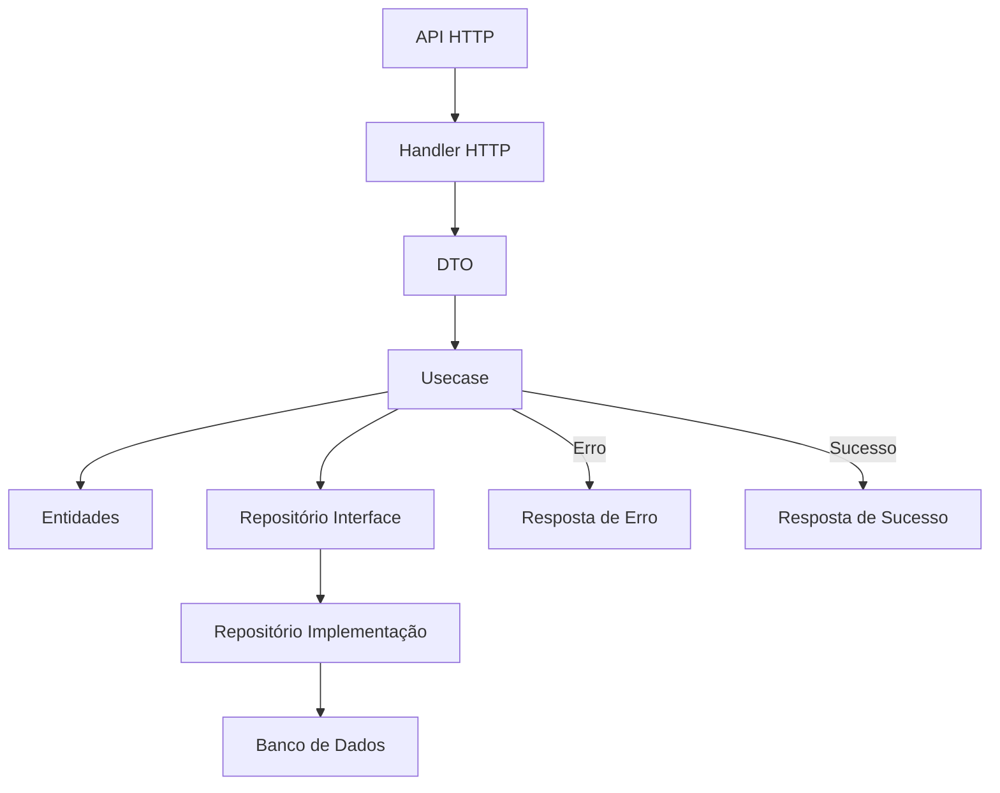
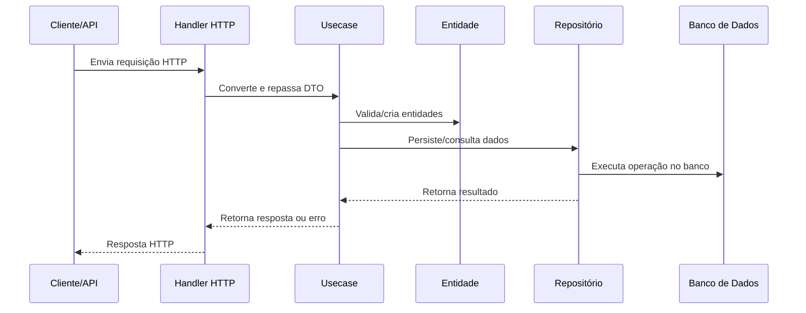

# vopi-go-poc

## Versão do Go

Este projeto utiliza Go 1.24.4

## Descrição do Projeto

Este projeto é uma prova de conceito (POC) de backend para chat, bots e gerenciamento de pessoas, utilizando Go, Clean Architecture e Package by Feature. O objetivo é demonstrar uma arquitetura escalável, testável e de fácil manutenção, com separação clara de responsabilidades.

## Abordagens Utilizadas

- **Clean Architecture**: Separação de camadas (entidades, casos de uso, interfaces, infraestrutura).
- **Package by Feature**: Cada módulo (ex: chat, person, bot) possui sua própria estrutura interna.
- **Go Proverbs & Boas Práticas**: Interfaces pequenas, nomes claros, baixo acoplamento.
- **SOLID**: Princípios aplicados na modelagem dos casos de uso e dependências.

## Estrutura de Pastas

```
internal/
  chat/
    entity/        # Entidades de domínio do chat
    usecase/       # Casos de uso (ex: criar chat)
    infra/         # Infraestrutura (repositórios, handlers HTTP)
    chat.go        # Orquestrador do módulo
  person/
    ...
cmd/
  api/
    main.go        # Ponto de entrada da aplicação
```

## Fluxo de Processamento das Requisições

1. **Entrada HTTP**: Recebida por um handler (ex: CreateChatHandler).
2. **DTO**: Payload convertido para DTO de entrada.
3. **Usecase**: Handler chama o caso de uso, que executa regras de negócio.
4. **Entidades**: Validação e criação de entidades de domínio.
5. **Repositório**: Persistência via interface de repositório (injeção de dependência).
6. **Resposta**: Usecase retorna resultado ou erro, handler formata resposta HTTP.

## Como Manter e Gerar Novos Pacotes

- Para criar um novo módulo, siga o padrão de package by feature:
  - Crie uma pasta em `internal/` com subpastas `entity`, `usecase`, `infra`.
  - Implemente entidades, casos de uso e handlers/repositórios específicos.
- Use interfaces para dependências e injete via construtores.
- Siga o padrão de nomes idiomáticos do Go.

## Fluxos de Requests (Exemplo: Criar Chat)

1. POST `/chat` com JSON de participantes e mensagens.
2. Handler converte para DTO e chama o usecase.
3. Usecase valida, cria entidades e persiste via repositório.
4. Resposta HTTP com sucesso ou erro de validação.

## Fluxograma do Processamento das Requisições



**Legenda:**

- API HTTP: Recebe requisições externas
- Handler HTTP: Converte payloads, chama casos de uso
- DTO: Objeto de transferência de dados
- Usecase: Orquestra regras de negócio
- Entidades: Modelos de domínio
- Repositório: Interface e implementação para persistência
- Banco de Dados: Persistência final
- Resposta: HTTP de sucesso ou erro

## Diagrama de Sequência da Interação dos Componentes



## Como Rodar

```sh
make start-dev
```

## Observações

- O projeto não versiona o vendor/ por padrão.
- Para builds reprodutíveis/offline, adicione vendor/ ao repositório.
- Siga as convenções do Go para novos módulos e contribuições.
